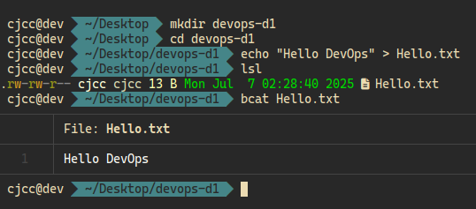

# Primera tarea del reto de DevOps 90 días con Rox

> ## **_Reflexión Personal:_**

En mi opinión, DevOps es el ejercicio que se lleva a cabo, para integrar de manera efectiva al desarrollo de software y las operaciones de tecnología de la información(TI). Buscando así, una mejora conjunta en el mantenimimento y optimización de las aplicaciones desarrolladas en servicio.

Sumado a esto, se puede decir que al integrar estos dos ecosistemas, logramos lo siguiente:

1. Menos retraso en las entregas de las aplicaciones.
2. Una mayor calidad en las entregas del software y en su despliegue a producción.
3. Softwares más estables y con una visión de cambios sin miedo a que hayan fallos recurrentes en el mismo.
4. Creación de una cultura colaborativa entre dos unidades que tiene como finalidad, el mismo objetivo. Desplegar software optmizado y con menos margen de error.

> ## **_Herramientas Conocidas:_**

Actualmente, solo tengo conocimientos en:

- Sistemas Operativo GNU/Linux.
- Docker y Docker Compose (Básico).
- Bash (Básico).
- Git + GitHub
- AWS(EC2-EKS-S3-DynamoDB-Lambda) (Básico)
- Markdown

> ## **_Herramientas Nuevas:_**

- Vagrant
- GitHub Action
- Kubernetes
- Terraform
- Ansible
- Jenkins
- Prometeus y Grafana
- LocalStack
- Kind/MiniKube
- CI/CD GitHub Actions
- K8s
- Trivy

---

> ### **_Comandos Básicos:_**

 
Leyenda: El comando `lsl` es un alias que tengo configurado en el directorio _.zshrc_ para utilizar (ls deluxe) que es una versión mejorarada del comando `ls`, utilizada por el comando `lsd`, para mostrar una presentación más atractiva en la terminal. Ej: `ls=lsd`.

 
Leyenda: El comando `bcat` tambien es un alias que utilizo en reemplazo del comando `cat`. Es un complemento para que muestre la salida con mejoras visuales y funcionales.

> ## **_Desafío Linux detective:_**

Usando los comandos en la terminal, respondo las siguientes preguntas:

1. ¿Cuánto tiempo lleva encendido tu sistema?

Se puede apreciar que el sistema tiene:

1. Encendido desde las 12:30pm.
2. Hora actual 02:47am con 29 segundos.
3. Un solo usuario conectado.
4. El promedio de carga del sistema en los últimos 1, 5 y 15 minutos.

---

 
2. ¿Qué procesos están consumiendo más recursos?

Al introducir el comando `top` muestra que los procesos que está consumiendo mas recursos son: los del navegador en cuanto al CPU.

Por otra parte si verificamos el consumo de memoría: ↓

Podemos observar que el navegador, el visual studio code, y la aplicación de signal.

---

3. ¿Cuánta memoria disponible tenemos?

Con el mando `free -h` podemos observar que la memoria disponible del equipo es: 2.2Gb

---
